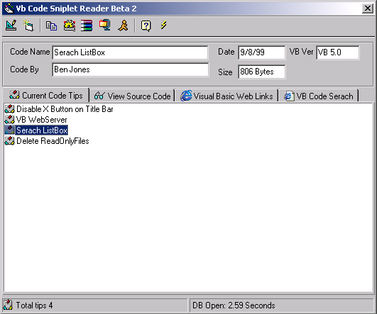



## Vb Code Sniplet Reader Beta 2

### Description

Hi this is a cool little project I made to keep all my source code on one handy place I made this project about 5 months ago but know I have updated it and added some more cool things Like the Listview controls and also it does not use a dat file any more it know uses a Microsoft Access file so you can add more code. Anyway I hope you like it or come in handy. Please Vote if you do Thanks.
 
### More Info
 

             |
---                |---
**Submitted On**   |2001-02-04 17:08:36
**By**             |[dreamvb](https://github.com/Planet-Source-Code/PSCIndex/blob/master/ByAuthor/dreamvb.md)
**Level**          |Beginner
**User Rating**    |4.2 (21 globes from 5 users)
**Compatibility**  |VB 6\.0
**Category**       |[Complete Applications](https://github.com/Planet-Source-Code/PSCIndex/blob/master/ByCategory/complete-applications__1-27.md)
**World**          |[Visual Basic](https://github.com/Planet-Source-Code/PSCIndex/blob/master/ByWorld/visual-basic.md)
**Archive File**   |[CODE\_UPLOAD14474232001\.zip](https://github.com/Planet-Source-Code/dreamvb-vb-code-sniplet-reader-beta-2__1-14966/archive/master.zip)

